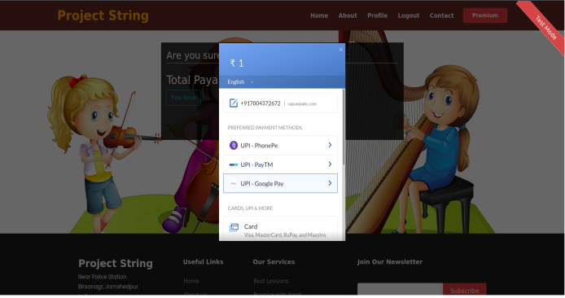

# Project-String

- Implemented RazorPay payment gateway

- static file are getting fetched from awsS3

- A fascility of password change is added. An email with the security token will be send to users email.

&nbsp;

  
   
  
   
   
   

